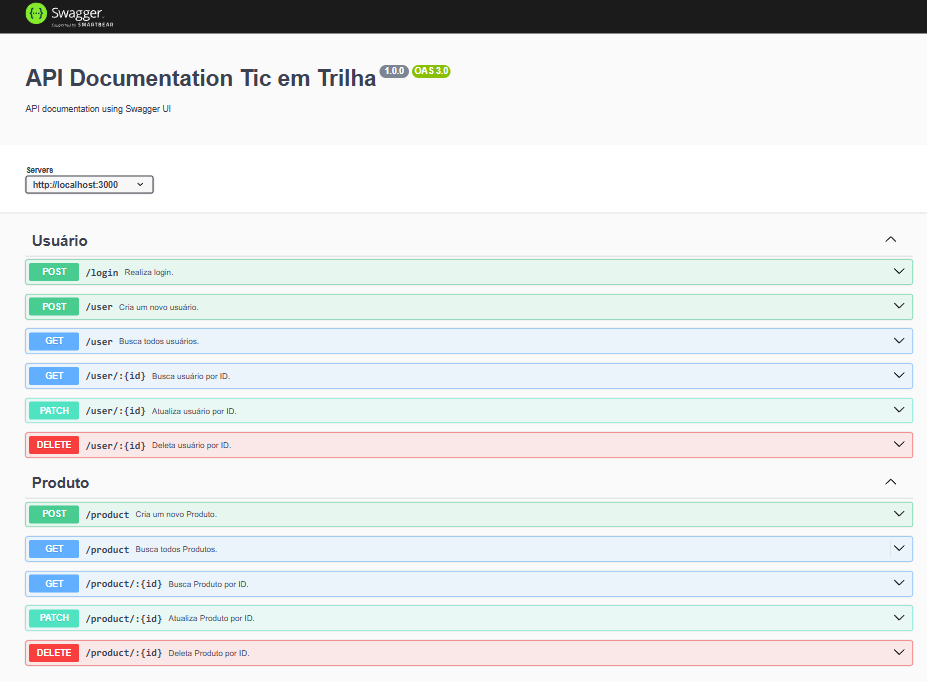

# Aplicação de Gerenciamento de Usuários e Produtos

## 💻 Descrição do projeto

Este projeto tem como objetivo fornecer uma API RESTful para gerenciamento de usuários e produtos. Ele permite operações como criação, leitura, atualização e exclusão de usuários e produtos, além de autenticação e autorização de usuários.

> **Colaboração:** Not found  
> **Status:**  Concluído ✔️

  
 👀 Prévia 

  

## 📜 Índice

- [Descrição](#-descrição-do-projeto)
- [Conceitos Aprendidos](#-conceitos-aprendidos)
- [Tecnologias Utilizadas](#-tecnologias-utilizadas)
- [Instalação](#-instalação)
- [Uso](#-uso)
- [Funcionalidades](#-funcionalidades)
- [Pendências](#-pendências)
- [Contribuição](#-contribuição)
- [Informações Adicionais](#-informações-adicionais)
- [Licença](#-licença)
- [Conclusão](#-conclusão)

## ✅ Conceitos Aprendidos 

- Estruturação de API RESTful.
- Integração com banco de dados utilizando Sequelize.
- Implementação de autenticação com JWT e Passport.
- Configuração de Swagger para documentação de APIs.
- Boas práticas no desenvolvimento de rotas e controladores.
- Implementação de arquitetura adaptada MVC

## 🛠 Tecnologias Utilizadas

## ⚙ Instalação

Para começar a usar este projeto, acesse no GitHub a aba [Wiki](https://github.com/IgoRenatoo/NodeJs-Tic-ProjectsCourseTicEmTrilhas/wiki/%F0%9F%92%A1-Instru%C3%A7%C3%B5es-de-uso) do projeto!

## 🚀 Uso

1. Inicie o servidor:
   <pre>npm run dev</pre>

2. Utilize um cliente HTTP (como Postman ou Insomnia) para interagir com as rotas disponíveis:

    - **Usuários:**
      > `POST /login` - Login de usuário.  
      > `POST /user` - Criação de usuário.  
      > `GET /user/:id` - Busca usuário por ID.  
      > `GET /users` - Lista de todos os usuários.  
      > `PATCH /user/:id` - Alterar usuário por ID (autenticação necessária).  
      > `DELETE /user/:id` - Deleta usuário por ID.

    - **Produtos:**
      > `POST /product` - Criação de produto.  
      > `GET /product/:id` - Busca produto por ID.  
      > `GET /products` - Lista de todos os produtos.  
      > `PATCH /product/:id` - Alterar produto por ID (autenticação necessária).  
      > `DELETE /product/:id` - Deleta produto por ID.

## 🧩 Funcionalidades

1. **logInUser()**
   - Realiza o login do usuário e gera um token JWT.

2. **createUser()**
   - Cria um novo usuário no banco de dados.

3. **getUsers()**
   - Retorna uma lista com todos os usuários.

4. **createProduct()**
   - Adiciona um novo produto no sistema.

5. **getProducts()**
   - Lista todos os produtos cadastrados.

## ⏳ Pendências

Atualmente o código está completo e funcional, sem pendências conhecidas.

## 🤝 Contribuição

Contribuições são bem-vindas! Se você deseja contribuir com este projeto, acesse no GitHub a aba [Wiki](https://github.com/IgoRenatoo/NodeJs-Tic-ProjectsCourseTicEmTrilhas/wiki/%F0%9F%92%A1-Instru%C3%A7%C3%B5es-de-uso) do projeto!

## 💡 Informações adicionais

- A API possui autenticação baseada em JWT.
- Utiliza Swagger para documentação automatizada.
- Configuração de ambiente com variáveis em `.env`.

## 🔓 Licença

Este projeto está licenciado sob a Licença MIT.

## 🏁 Conclusão

Este projeto consolidou conceitos essenciais para o desenvolvimento de APIs modernas e escaláveis, utilizando tecnologias atuais como TypeScript, Node.js e Sequelize. Ele é uma base sólida para projetos futuros, especialmente os que envolvem sistemas de autenticação e gerenciamento de recursos.

🚀 "O código não mente, mas pode te surpreender!"
